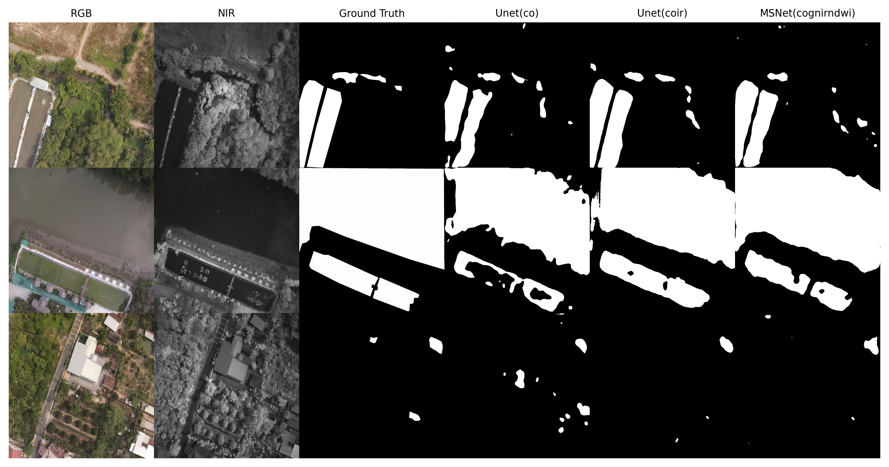

# WaterMAI

This is the official github page of the WaterMAI dataset and benchmarking implementation described in the following paper.

>[Use of low-cost drones to map arbovirus vector habitats with multispectral aerial imagery]().

> Pham Viet Hoang, Ngo Phuc Linh, Bui Ngoc Long, Vo Bich Hien, Thirumalaisamy P. Velavan, Tran Duc Khanh

## WaterMAI Dataset Specification
- The structure of `train` and `test` folder are the same
- Folder `color` and `ir` in `labels` folder are the bounding box labels (YOLO type) of WaterMAI dataset. The difference between 2 folders is only the name of each file.
- Folder `mask_co` in `labels` folder is the segmentation label mask of WaterMAI dataset.

```shell
WaterMAI_dataset
├── train
│   ├── images
│   │   ├── color
│   │   │   ├── DJI_1010_co.jpg
│   │   │   ├── ...
│   │   │   └── DJI_13970_co.jpg
│   │   └── ir
│   │       ├── DJI_1010_ir.jpg
│   │       ├── ...
│   │       └── DJI_13970_ir.jpg
│   └── labels
│   │   ├── color
│   │   │   ├── DJI_1010_co.txt
│   │   │   ├── ...
│   │   │   └── DJI_13970_co.txt
│   │   ├── ir
│   │   │   ├── DJI_1010_ir.txt
│   │   │   ├── ...
│   │   │   └── DJI_13970_ir.txt
│   │   └── mask_co
│   │   │   ├── DJI_1010_co.jpg
│   │   │   ├── ...
│   │   │   └── DJI_13970_co.jpg
└── test
    ├── images
    │   ├── color
    │   │   └── ...
    │   └── ir
    │   │   └── ...
    └── labels
        ├── color
        │   └── ...
        ├── ir
        │   └── ...
        └── mask_co
            └── ...
```
## Example
Please download the WaterMAI dataset from [**WaterMAI_dataset**](https://drive.google.com/file/d/1Mz9kcKh5ZbxWeyloS_3EbYFFkkTqySz5/view?usp=drive_link)
- 1st column contains raw RGB images
- 2nd column contains raw NIR images
- 3rd column contains the ground truth segmentation
- 4th column contains Unet result from RGB images (3 channels)
- 5th column contains Unet result from RGB + NIR images (4 channels)
- 6th column contains Unet result from RGB + Green + NIR + NDWI images (6 channels)



## Setup

> The implementation is developped and successfully run on Ubuntu 20.04; Python 3.9; GPU: RTX 2060 6G VRAM

Please download the weights of MSNet, RTFNet and UNet models with each modality combination and save them in `weights` folder

> [**MSNet_coir_checkpoints**](https://drive.google.com/file/d/1G2Lc-YUPxoOdAMFxDmRRF0LSUrupwHFt/view?usp=sharing)

> [**MSNet_condwi_checkpoints**](https://drive.google.com/file/d/1IcmFXD_276gv1U_Dlx25XiyF9mAVu9oj/view?usp=sharing)

> [**MSNet_cognirndwi_checkpoints**](https://drive.google.com/file/d/196tTcM1Sk3URJ2qsYeAEZ-wKTs_VrAdG/view?usp=drive_link)

> [**RTFNet_coir_checkpoints**](https://drive.google.com/file/d/1f5BGwwQcp2qFDK4Z3Qd-Z-9nTxgppWcX/view?usp=drive_link)

> [**RTFNet_condwi_checkpoints**](https://drive.google.com/file/d/1wHP-sSuYxbOf0pRG3uCX-6HcShN5cUmE/view?usp=drive_link)

> [**UNet_coir_checkpoints**](https://drive.google.com/file/d/12BrnJ1zAAS8CDQ1Ny2P2qlxizRxPsK4i/view?usp=drive_link)

> [**UNet_condwi_checkpoints**](https://drive.google.com/file/d/1yykkT6Y5Btxexej5aIWWsDEudxy6jPDc/view?usp=drive_link)

> [**UNet_cognirndwi_checkpoints**](https://drive.google.com/file/d/1vXet8v6oP8pcGz_p8_9nXgnpmpGSU9Q_/view?usp=drive_link)

To generate the modality combination images such as `coir` (RGB  + NIR), `condwi` (RGB + NDWI) or `cognirndwi` (RGB + Green + NIR + NDWI), please following the instruction in [`prepare_modalities.ipynb`](https://github.com/Hoangpham13579/WaterMAI/blob/8cfae3dc9f8a11efa169a208cac1aa2dc2d6c041/notebooks/prepare_modalities.ipynb) notebook in the `notebooks` folder

To install the dependencies, please use the following
```
pip3 install -r requirements.txt
```
Please install Pytorch GPU appropriate with your hardware configuration.

## Evaluate
To perform the evaluation of  **MSNet**, **RTFNet** and **UNet** models on the WaterMAI's test set by using 3 different modality combinations `coir` (RGB  + NIR), `condwi` (RGB + NDWI) or `cognirndwi` (RGB + Green + NIR + NDWI), please following the instruction in [`evaluate_coir_condwi_cognirndwi.ipynb`](https://github.com/Hoangpham13579/WaterMAI/blob/8cfae3dc9f8a11efa169a208cac1aa2dc2d6c041/notebooks/evaluate_coir_condwi_cognirndwi.ipynb) notebook in the `notebooks` folder
#### Prerequisite
1. `The path in the 1st cells` should be modified properly to sucessfully run the notebook
2. Finish runing [`prepare_modalities.ipynb`](https://github.com/Hoangpham13579/WaterMAI/blob/8cfae3dc9f8a11efa169a208cac1aa2dc2d6c041/notebooks/prepare_modalities.ipynb) notebook in the `notebooks` folder for WaterMAI's test set

## Training
To perform the training of  **MSNet**, **RTFNet** and **UNet** models on the WaterMAI's train set by using 3 different modality combinations `coir` (RGB  + NIR), `condwi` (RGB + NDWI) or `cognirndwi` (RGB + Green + NIR + NDWI), please following the instruction in [`train_coir_condwi_cognirndwi.ipynb`](https://github.com/Hoangpham13579/WaterMAI/blob/8cfae3dc9f8a11efa169a208cac1aa2dc2d6c041/notebooks/train_coir_condwi_cognirndwi.ipynb) notebook in the `notebooks` folder 
#### Prerequisite
1. `The path in the 1st cells` should be modified properly to sucessfully run the notebook
2. Finish runing [`prepare_modalities.ipynb`](https://github.com/Hoangpham13579/WaterMAI/blob/8cfae3dc9f8a11efa169a208cac1aa2dc2d6c041/notebooks/prepare_modalities.ipynb) notebook in the `notebooks` folder for WaterMAI's train set

## Reference
[Pytorch-UNet](https://github.com/milesial/Pytorch-UNet)

[RTFNet](https://github.com/yuxiangsun/RTFNet)

[MSNet](https://github.com/taochx/MSNet)

## Citation

If you find this repo useful for your research, please consider citing our paper:

```bibtex

```

