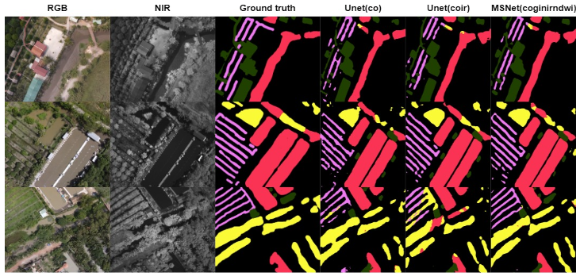

# WaterMAI

This is the official github page of the WaterMAI dataset and benchmarking implementation described in the following paper.

>[Use of low-cost drones to map arbovirus vector habitats with multispectral aerial imagery to detect water bodies]().

> Ngo Phuc Linh, Pham Viet Hoang, Bui Ngoc Long, Phan Huynh Anh Thu, Vo Bich Hien, Thirumalaisamy P. Velavan, Tran Duc Khanh

## WaterMAI Dataset Specification
Please download the WaterMAI dataset from [**WaterMAI_dataset**](https://drive.google.com/drive/folders/1-4EVZL1kFL2F72kpPst5z-YSsYrxhxeA?usp=sharing) and orthomosaic images from [**WaterMAI Orthomosaic**](https://drive.google.com/drive/folders/1ibAqoicHApP8f5G7uiAym4Lti5mGdZXH?usp=sharing)


- Folder `co` and `ir` in `labels` folder are the bounding box labels (YOLO type) of WaterMAI dataset. The masks of those 2 folders are the same, only the file's names are different
- Folder `mask_co` in `labels` folder is the segmentation label mask of WaterMAI dataset.

```shell
WaterMAI_dataset
├── images
│   ├── co
│   │   ├── val_co.txt
│   │   ├── train_co.txt
│   │   ├── DJI_1010_co.jpg
│   │   ├── ...
│   │   └── DJI_13970_co.jpg
│   └── ir
│       ├── val_ir.txt
│       ├── train_ir.txt
│       ├── DJI_1010_ir.jpg
│       ├── ...
│       └── DJI_13970_ir.jpg
└── labels
│    ├── color
│    │   ├── DJI_1010_co.txt
│    │   ├── ...
│    │   └── DJI_13970_co.txt
│    ├── ir
│    │   ├── DJI_1010_ir.txt
│    │   ├── ...
│    │   └── DJI_13970_ir.txt
│    └── mask_co
│        ├── DJI_1010_co.png
│        ├── ...
│        └── DJI_13970_co.png
│___testset
     ├── images
     │     ├── co
     │     │   ├── DJI_0010_102_co.jpg
     │     │   └── ...
     │     └── ir
     │         ├── DJI_0010_102_ir.jpg
     │         └── ...
     ├── labels
           ├── color
           │   ├── DJI_0010_102_co.txt
           │   └── ...
           ├── ir
           │   ├── DJI_0010_102_ir.txt
           │   └── ...
           └── mask_co
               ├── DJI_0010_102_co.png
               └── ...
           
```
## Example


- 1st column contains raw RGB images
- 2nd column contains raw NIR images
- 3rd column contains the ground truth segmentation
- 4th column contains Unet result from RGB images (3 channels)
- 5th column contains Unet result from RGB + NIR images (4 channels)
- 6th column contains Unet result from RGB + Green + NIR + NDWI images (6 channels)

## Setup

> The implementation is developped and successfully run on Ubuntu 20.04; Python 3.9; GPU: RTX 2060 6G VRAM

Please download the weights of MSNet, RTFNet and UNet models with each modality combination from [MODEL_CHECKPOINTS](https://drive.google.com/drive/folders/16hAC0StVlxSq59yJr8n0u7k41hdgXOvB?usp=sharing) and save them in `weights` folder

To generate the modality combination images such as `coir` (RGB  + NIR), `condwi` (RGB + NDWI) or `cognirndwi` (RGB + Green + NIR + NDWI), please following the instruction in [`prepare_modalities.ipynb`](https://github.com/Hoangpham13579/WaterMAI/blob/740abebd5d7df769122693cecfa8884e9016eef4/notebooks/prepare_modalities.ipynb) notebook in the `notebooks` folder

To install the dependencies, please use the following
```
pip3 install -r requirements.txt
```
Please install Pytorch GPU appropriate with your hardware configuration.

## Evaluate
To perform the evaluation of  **MSNet**, **RTFNet** and **UNet** models on the WaterMAI's test set by using 3 different modality combinations `coir` (RGB  + NIR), `condwi` (RGB + NDWI) or `cognirndwi` (RGB + Green + NIR + NDWI), please following the instruction in [`evaluate_coir_condwi_cognirndwi.ipynb`](https://github.com/Hoangpham13579/WaterMAI/blob/740abebd5d7df769122693cecfa8884e9016eef4/notebooks/evaluate_coir_condwi_cognirndwi.ipynb) notebook in the `notebooks` folder
#### Prerequisite
1. Please change `YOUR_PATH_TO` in the `notebook` to the location in your computer
2. Please run [`prepare_modalities.ipynb`](https://github.com/Hoangpham13579/WaterMAI/blob/740abebd5d7df769122693cecfa8884e9016eef4/notebooks/prepare_modalities.ipynb) in the `notebooks` folder for preparing WaterMAI's test set with multiple modality combinations

## Training
To perform the training of  **MSNet**, **RTFNet** and **UNet** models on the WaterMAI's train set by using 3 different modality combinations `coir` (RGB  + NIR), `condwi` (RGB + NDWI) or `cognirndwi` (RGB + Green + NIR + NDWI), please following the instruction in [`train_coir_condwi_cognirndwi.ipynb`](https://github.com/Hoangpham13579/WaterMAI/blob/740abebd5d7df769122693cecfa8884e9016eef4/notebooks/train_coir_condwi_cognirndwi.ipynb) notebook in `notebooks` folder 
#### Prerequisite
1. Please change `YOUR_PATH_TO` in the `notebook` to the location in your computer
2. Please run [`prepare_modalities.ipynb`](https://github.com/Hoangpham13579/WaterMAI/blob/740abebd5d7df769122693cecfa8884e9016eef4/notebooks/prepare_modalities.ipynb) in the `notebooks` folder for preparing WaterMAI's training set with multiple modality combinations

## Reference
[Pytorch-UNet](https://github.com/milesial/Pytorch-UNet)

[RTFNet](https://github.com/yuxiangsun/RTFNet)

[MSNet](https://github.com/taochx/MSNet)

## Citation

If you find this repo useful for your research, please consider citing our paper:

```bibtex

```
---


